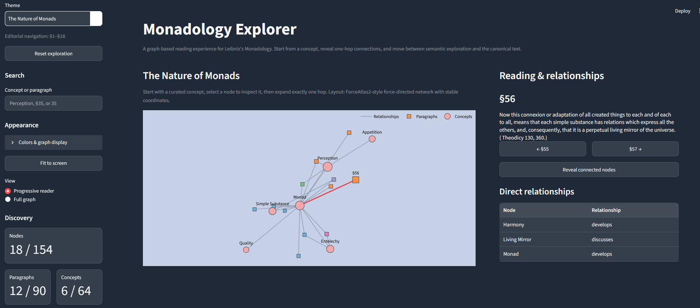
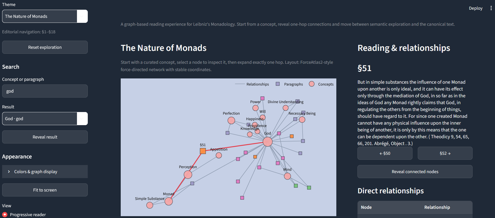
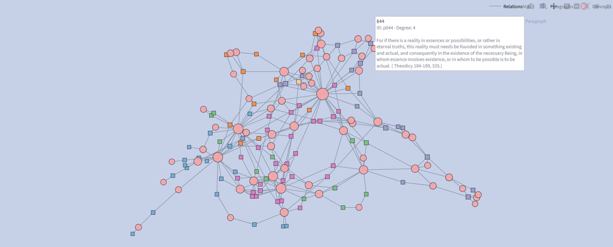

# Monadology Explorer

An interactive, graph-based reading experience for **Gottfried Wilhelm Leibniz's _Monadology_**.

Monadology Explorer connects the canonical text to a curated semantic network of philosophical concepts and relationships. Instead of reading the work only as a linear sequence of paragraphs, readers can begin with a concept, reveal its immediate connections, move through related ideas and return to the canonical text at any point.

The application is built with **Python, Streamlit, Plotly and NetworkX** and is designed as a focused desktop-first exploration tool.



## Features

- **Progressive graph exploration** — begin from curated concepts and reveal exactly one hop at a time.
- **Persistent discovery** — previously revealed nodes remain visible as exploration continues.
- **Canonical paragraph reader** — inspect all 90 paragraphs of the _Monadology_.
- **Sequential reading** — move directly to the previous or next paragraph.
- **Concept and paragraph search** — search concepts case-insensitively or jump to a paragraph using forms such as `35` or `§35`.
- **Direct relationship inspection** — see the semantic relationship between the selected node and each immediate neighbor.
- **Interactive graph** — select nodes, pan, zoom, inspect relationships and read paragraph text directly from paragraph hover cards.
- **Stable graph layout** — deterministic ForceAtlas2-style coordinates prevent the network from rearranging as nodes are revealed.
- **Full-graph mode** — inspect the complete curated network and high-level graph metrics.
- **Theme-based navigation** — explore the work through six editorial themes.
- **Theme coloring** — paragraph nodes can be colored by editorial theme, producing a visual cluster-like reading of the work.
- **Runtime appearance controls** — customize concept, paragraph, relationship, selected-relationship, graph-background, dashboard-background and theme colors.
- **Fit-to-screen mode** — compact presentation for graph and reading content.
- **Discovery metrics** — track discovered nodes, paragraphs and concepts during exploration.
- **Dataset validation** — repository-controlled data is validated before the application starts.

## Interactive Reading

Explore philosophical concepts and canonical paragraphs together. Select nodes,
reveal one-hop relationships, search the text, and move between graph exploration
and sequential reading.



## Exploration Model

The application deliberately separates **semantic exploration** from **canonical reading**.

In the default **Progressive reader** mode, each theme begins with a small set of curated starting concepts. Selecting a node allows the reader to inspect it; choosing **Reveal connected nodes** expands the visible network by exactly one graph hop. Nodes already discovered are never removed by expansion.

This produces an incremental exploration process rather than presenting the complete network immediately.

The **Full graph** view provides the complementary inspection mode, showing the entire curated graph together with paragraph, concept, relationship and connected-component counts.

## Full-Graph Exploration

The full-graph view exposes the complete curated semantic network, making broader structural patterns, thematic groupings, and highly connected concepts visible.



## Dataset

The runtime application reads four repository-controlled JSON datasets:

```text
data/
├── concepts.json
├── edges.json
├── paragraphs.json
└── themes.json
```

The graph contains:

- **90 canonical paragraphs**
- **64 curated concepts**
- **292 curated relationships**
- **6 editorial themes**

Paragraph nodes contain the canonical text and theme assignment. Concept nodes represent curated philosophical ideas. Edges contain semantic relationship labels and may also contain editorial notes.

The v1 graph is intentionally **undirected**. Its relationships represent semantic association and development rather than formal causal, logical or proof direction.

## Text Source and Curation

The canonical English text is derived from the **Robert Latta translation of Leibniz's _Monadology_ available through Wikisource**.

`Archive/` retains source material used during curation. The deployed application does **not** retrieve the text from Wikisource at runtime; it reads the repository's generated and validated static JSON dataset.

`scripts/build_paragraphs.py` is a development-time acquisition utility that extracts paragraphs §1–§90 and assigns them to the configured editorial theme ranges.

The concepts, themes and semantic relationships are curated project data. They should be understood as an exploratory editorial layer over the canonical text, not as part of Leibniz's original work.

## Project Structure

```text
Monadology-Explorer/
├── Archive/                     # Archived source/curation material
├── data/
│   ├── concepts.json            # Curated philosophical concepts
│   ├── edges.json               # Curated semantic relationships
│   ├── paragraphs.json          # Canonical paragraphs §1–§90
│   └── themes.json              # Editorial themes and starting concepts
├── docs/                        # Project documentation
├── scripts/
│   ├── build_paragraphs.py      # Development-time canonical-text builder
│   ├── inspect_dataset.py       # Dataset inspection utility
│   └── inspect_graph.py         # Graph structure/QA utility
├── src/
│   └── monadology_explorer/
│       ├── __init__.py
│       ├── exploration.py       # Search and exploration behavior
│       ├── graph.py             # Graph construction and layouts
│       ├── loader.py            # JSON dataset loading
│       ├── models.py            # Immutable domain models
│       └── validation.py        # Dataset-contract validation
├── tests/                       # Pytest test suite
├── app.py                       # Streamlit application
├── DECISIONS.md                 # Important design and implementation decisions
├── pyproject.toml               # Package metadata and dependencies
└── README.md
```

## Requirements

- Python **3.12**
- A modern web browser

Runtime dependencies are declared in `pyproject.toml`:

- Streamlit
- Plotly
- NetworkX

Development dependencies additionally include:

- pytest
- Ruff
- Beautiful Soup

A separate `requirements.txt` is intentionally not required; `pyproject.toml` is the project's dependency and package configuration source.

## Installation

Clone the repository and enter the project directory:

```bash
git clone <repository-url>
cd Monadology-Explorer
```

Create and activate a Python 3.12 environment using your preferred environment manager.

Then install the project:

```bash
python -m pip install -e .
```

For development, testing, dataset tooling and linting:

```bash
python -m pip install -e ".[dev]"
```

## Running the Application

From the repository root:

```bash
streamlit run app.py
```

Streamlit will start a local server and open the application in your browser.

The application expects the `data/` directory to be available relative to the repository root.

## Using the Explorer

1. Select an editorial **Theme**.
2. Begin with the curated starting concepts displayed in the graph.
3. Select a concept or paragraph to inspect it.
4. Use **Reveal connected nodes** to expand exactly one hop.
5. Search for a concept or paragraph when you want to jump elsewhere.
6. Use **Visible nodes** to return to something already discovered.
7. Select paragraph nodes to read the canonical text and navigate sequentially.
8. Switch to **Full graph** when you want to inspect the complete network.
9. Open **Colors & graph display** to customize the visualization at runtime.

Hovering over a paragraph node displays its canonical paragraph text directly in the graph.

## Data Validation

The application validates the curated dataset before constructing the graph.

Validation includes checks for:

- exactly 90 canonical paragraphs;
- complete paragraph numbering from §1 through §90;
- duplicate paragraph and graph-node identifiers;
- empty paragraph text and concept names;
- valid and non-overlapping theme ranges;
- complete paragraph coverage by themes;
- valid theme starting concepts;
- valid paragraph-to-theme assignments;
- graph edges referencing known nodes; and
- non-empty relationship labels.

Invalid repository data causes an explicit dataset error rather than allowing the application to continue with a malformed graph.

Run the dataset inspection utility with:

```bash
python scripts/inspect_dataset.py
```

For graph connectivity and structural QA:

```bash
python scripts/inspect_graph.py
```

## Testing

The project uses **pytest** with behavior-focused tests covering exploration logic, graph construction, deterministic layout behavior, loading, validation, graph QA, appearance behavior and canonical-text extraction safeguards.

Run the complete suite with:

```bash
pytest
```

Current v1 verification:

```text
31 passed
0 warnings
```

## Code Quality

Ruff configuration is included in `pyproject.toml`.

Run the configured checks with:

```bash
ruff check .
```

The configured rule families include Pycodestyle errors, Pyflakes, import sorting, pyupgrade and flake8-bugbear checks.

## Deployment

The application is suitable for deployment on **Streamlit Community Cloud**.

The repository already defines its runtime dependencies in `pyproject.toml`, so deployment does not require a duplicate `requirements.txt`.

For deployment:

1. Push the repository to GitHub.
2. Create a Streamlit Community Cloud application from the repository.
3. Set the application entry point to `app.py`.
4. Deploy using a supported Python 3.12 runtime.

No external database, authentication service, API key or runtime content-fetching service is required for v1. The application operates from the static curated data committed to the repository.

## Design Principles

Monadology Explorer intentionally keeps its architecture small and explicit.

- **Repository-controlled data** rather than runtime scraping.
- **Pure exploration logic** separated from Streamlit presentation state.
- **Immutable domain models** for curated records.
- **Explicit dataset validation** before visualization.
- **Deterministic layouts** for spatial continuity.
- **Progressive disclosure** instead of immediately overwhelming the reader with the complete network.
- **No authentication or persistence** in v1.
- **Desktop-first interaction** rather than attempting to optimize the graph experience for mobile devices.

## Scope and Interpretation

Monadology Explorer is an exploratory reading and visualization project. The semantic network—its concepts, theme boundaries, relationship labels and connections—is a curated interpretation intended to support navigation and discovery.

It is **not** intended to replace a scholarly critical edition, establish a definitive interpretation of Leibniz or encode formal logical dependencies between propositions.

## Version

Current release: **v1.0.0**

## License and Source Attribution

The software, project-specific code and curated graph structure should be used under the license provided in this repository.

The _Monadology_ text is a separate source work. The English text used by this project is based on the Robert Latta translation hosted by Wikisource. Source-text copyright/public-domain status and attribution should therefore be treated separately from the software license.

---

**Monadology Explorer** — reading Leibniz through both text and structure.
